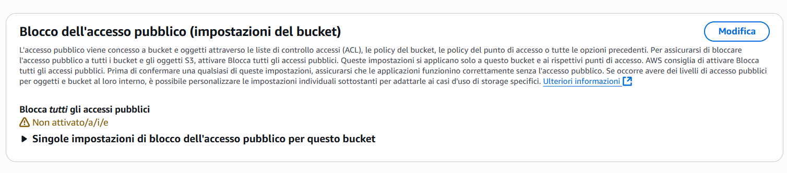
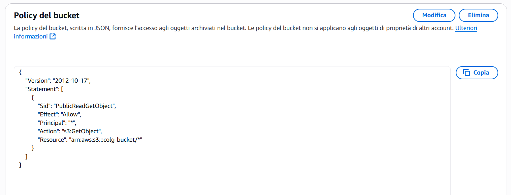
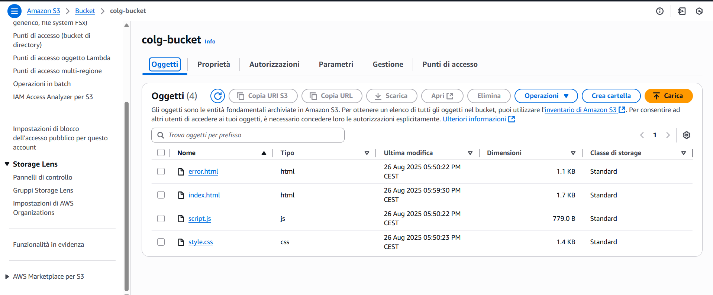
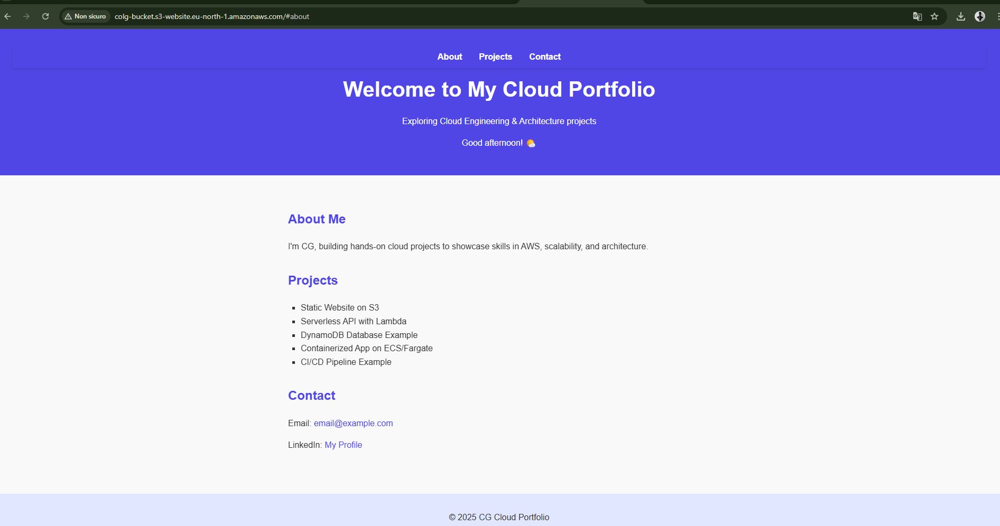

# Static Website Hosting on Amazon S3

This project demonstrates how to host a static website using **Amazon S3**.  
The website is built with **HTML, CSS, and JavaScript**, and includes a custom **404 error page**.

---

## 📌 Project Overview
The goal of this project is to deploy a simple static portfolio-style website on AWS, leveraging the scalability and reliability of Amazon S3.  

The setup simulates a real-world scenario where static websites can serve personal portfolios, company landing pages, or lightweight applications without the need for servers.

---

## 🛠️ Services Used
- **Amazon S3** → Object storage service used to host the static files (`index.html`, `styles.css`, `script.js`, `404.html`).  
- *(Optional)* **Amazon CloudFront** → Could be added as a CDN in front of S3 to improve performance and enable HTTPS.  
- *(Optional)* **AWS IAM / S3 Bucket Policy** → Used to configure permissions and allow public access to the website.  

---

## 📂 Project Structure
01-static-website-s3/
│── index.html # Main website page
│── styles.css # Stylesheet
│── script.js # JavaScript functionality
│── 404.html # Custom error page
│── docs/
│ ├── README.md # Documentation
│ └── screenshots/ # Screenshots of S3 configuration

---

## 🔑 Key Features
- Publicly accessible static website hosted on S3.  
- Custom **404 error page** for invalid routes.  
- Demonstrates how to configure S3 bucket policies and static website hosting.  
- Easily extensible: could include **Elastic Load Balancer** or **Auto Scaling Group** in case of a dynamic app/e-commerce scenario.  

---

## 🚀 Deployment Steps
1. Create an S3 bucket.  
2. Enable **Static website hosting**.  
3. Upload the website files.  
4. Set **Index document = index.html** and **Error document = 404.html**.  
5. Configure bucket permissions for public access.  
6. Access the site via the S3 **website endpoint**.  

---

## 📸 Screenshots

### 1. Allow Public Access

### 2. Bucket Policy

### 3. S3 Objects

### 4. Website Running in Browser

---

## 📚 Learning Outcomes
- Basics of hosting a static website on AWS.  
- Understanding of **S3 bucket policies** and **public access settings**.  
- Practical foundation for extending to **CloudFront** and more complex AWS architectures.  

---

👨‍💻 Author: CG  
📅 Year: 2025
